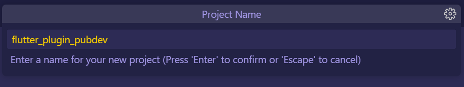
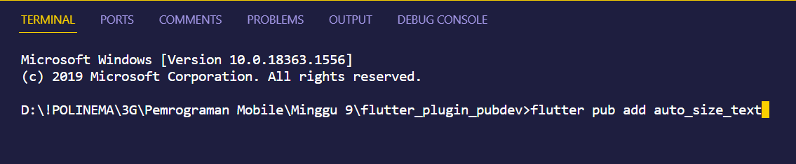
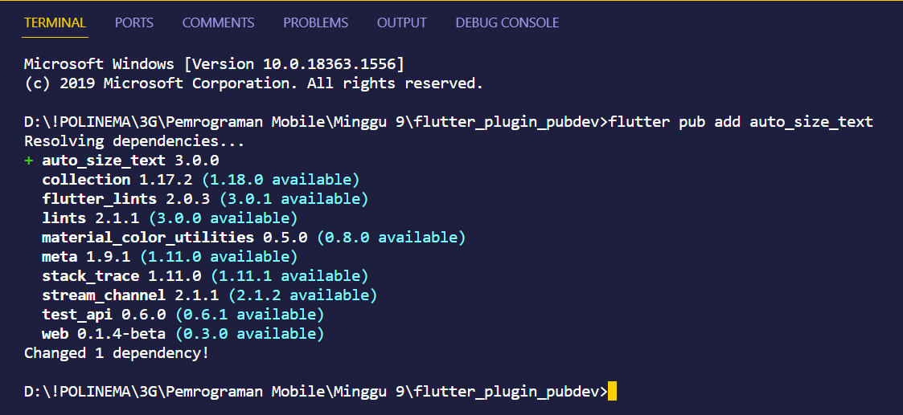
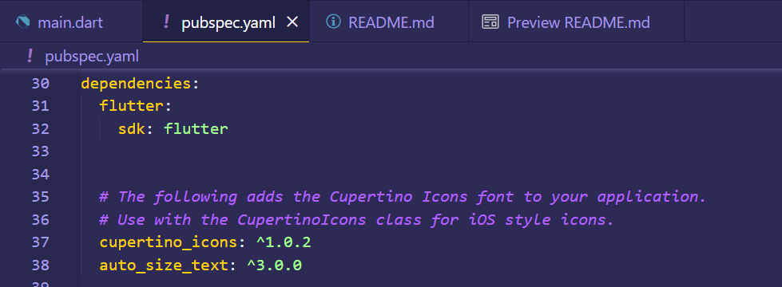
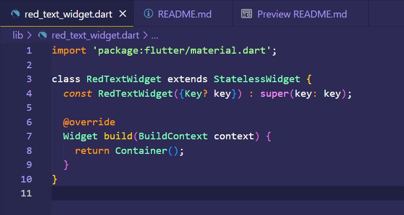
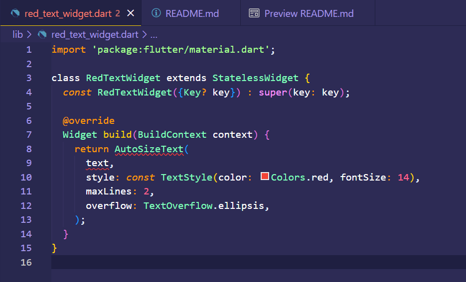
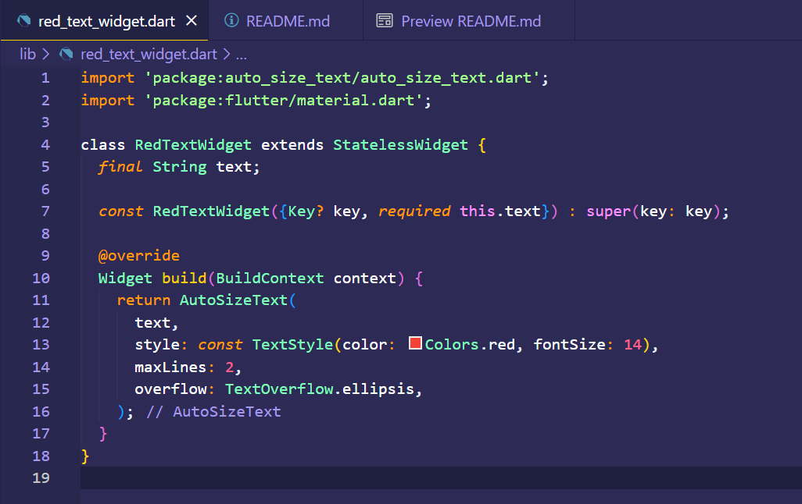
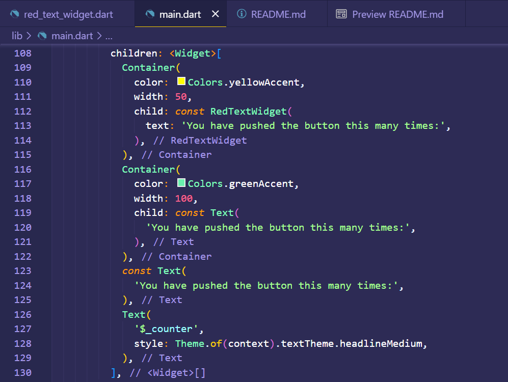
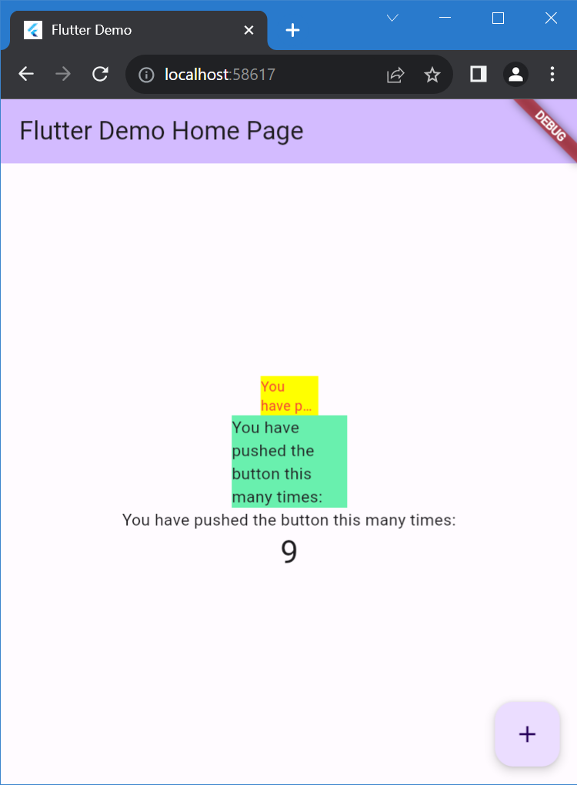

 

  <h3 align="center">PEMROGRAMAN MOBILE</h3>
    
  
    
  <h3 align="center">Falendika Tegar Pratama</h3>
  <h3 align="center">3G - D4TI</h3>
  <h3 align="center">2141720107</h3>

 

<h1 align="center">Laporan Praktikum Minggu Ke-9</h1>

 

<!-- ABOUT THE PROJECT -->
# Praktikum Menerapkan Plugin di Project Flutter

Selesaikan langkah-langkah praktikum berikut ini menggunakan editor Visual Studio Code (VS Code) atau Android Studio atau code editor lain kesukaan Anda.

### Langkah 1: Buat Project Baru

Buatlah sebuah project flutter baru dengan nama flutter_plugin_pubdev. Lalu jadikan repository di GitHub Anda dengan nama flutter_plugin_pubdev.

 

### Langkah 2: Menambahkan Plugin

Tambahkan plugin auto_size_text menggunakan perintah berikut di terminal

 

 

Jika berhasil, maka akan tampil nama plugin beserta versinya di file pubspec.yaml pada bagian dependencies.

 

### Langkah 3: Buat file red_text_widget.dart

Buat file baru bernama red_text_widget.dart di dalam folder lib lalu isi kode seperti berikut.

 

### Langkah 4: Tambah Widget AutoSizeText

Masih di file red_text_widget.dart, untuk menggunakan plugin auto_size_text, ubahlah kode return Container() menjadi seperti berikut.

 

Setelah Anda menambahkan kode di atas, Anda akan mendapatkan info error. Mengapa demikian? Jelaskan dalam laporan praktikum Anda!

<b>Penjelasan:</b> 

Error terjadi karena tidak ada parameter text yang diberikan pada widget RedTextWidget dan Widget AutoSizeText memerlukan parameter teks yang akan ditampilkan. Untuk mengatasi error ini, perlu menambahkan parameter text ke dalam konstruktor RedTextWidget dan menggunakan nilai tersebut dalam widget AutoSizeText.

 

### Langkah 5: Buat Variabel text dan parameter di constructorLangkah 5: Lengkapi kode di class HomePage

Tambahkan variabel text dan parameter di constructor seperti berikut.

 

### Langkah 6: Tambahkan widget di main.dart

Buka file main.dart lalu tambahkan di dalam children: pada class _MyHomePageState

 

Run aplikasi tersebut dengan tekan F5, maka hasilnya akan seperti berikut.

#### Hasil Output

 

# Tugas Praktikum

 

## Jelaskan maksud dari langkah 2 pada praktikum tersebut!

Langkah tersebut adalah instruksi untuk menambahkan plugin bernama "auto_size_text" ke dalam project flutter_plugin_pubdev. Plugin ini adalah paket perangkat lunak yang digunakan untuk mengatur ukuran teks sesuai dengan konten yang akan ditampilkan di dalam aplikasi. Dengan menambahkan plugin ini, dapat membuat teks yang akan secara otomatis menyesuaikan ukuran fontnya agar muat sesuai dengan area yang tersedia. Jadi, langkah ini merupakan bagian dari proses persiapan untuk menggunakan fitur-fitur yang disediakan oleh plugin "auto_size_text" dalam proyek flutter_plugin_pubdev.

 

## Jelaskan maksud dari langkah 5 pada praktikum tersebut!

- Kode baris pertama digunakan untuk menambahkan variabel text ke dalam class RedTextWidget. Variabel text akan digunakan untuk menentukan teks yang akan ditampilkan.
- Kode baris kedua menambahkan parameter required this.text ke dalam constructor RedTextWidget untuk memastikan bahwa saat membuat instance dari RedTextWidget, harus memberikan nilai teks yang diperlukan melalui parameter ini.

 

## Pada langkah 6 terdapat dua widget yang ditambahkan, jelaskan fungsi dan perbedaannya!

#### Widget Container pertama (warna: kuning, width: 50)
- Widget Container yang digunakan untuk mengelompokkan dan mengatur tampilan elemen lainnya dengan warna latar belakang kuning (Colors.yellowAccent). 
- Memiliki lebar (width) sebesar 50. 
- Terdapat RedTextWidget dengan teks tertentu yang akan ditampilkan.

#### Widget Container kedua (warna: hijau, width: 100)
- Widget Container dengan warna latar belakang yang berbeda, yaitu hijau (Colors.greenAccent). 
- Memiliki lebar (width) sebesar 100, sehingga lebarnya lebih besar daripada Widget Container pertama. 
- Terdapat widget Text dengan teks yang akan ditampilkan.

#### Perbedaan utama antara dua widget tersebut: 

- Container pertama menggunakan widget kustom RedTextWidget. Oleh karena itu, tampilan dan fungsionalitas dari RedTextWidget sepenuhnya tergantung pada implementasi yang dibuat untuknya.
- Container kedua menggunakan widget bawaan Flutter, yaitu Text. Text digunakan untuk menampilkan teks dengan gaya dan format tertentu. Text juga merupakan widget bawaan yang umum digunakan untuk menampilkan teks statis. Dalam hal ini, Text akan menampilkan teks "You have pushed the button this many times:".

 

## Jelaskan maksud dari tiap parameter yang ada di dalam plugin auto_size_text berdasarkan tautan pada dokumentasi ini!

Dalam plugin auto_size_text, parameter-parameter ini digunakan untuk mengontrol cara teks ditampilkan dan disesuaikan sesuai dengan kebutuhan Anda. Pastikan untuk merujuk ke dokumentasi terbaru yang Anda berikan untuk detail lebih lanjut dan penggunaan yang tepat.
